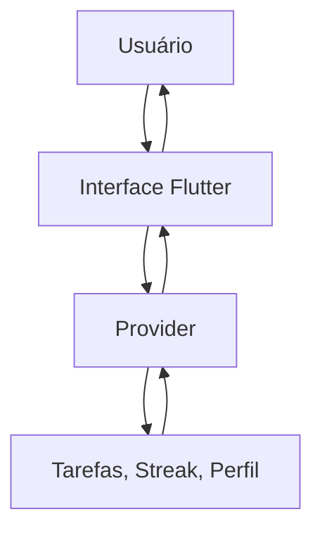
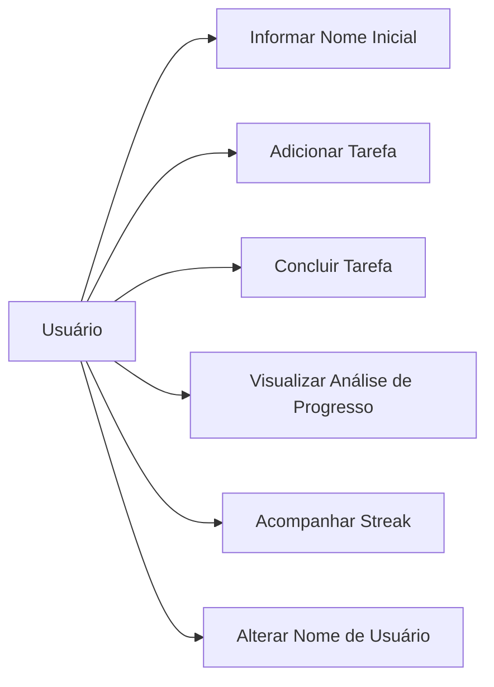
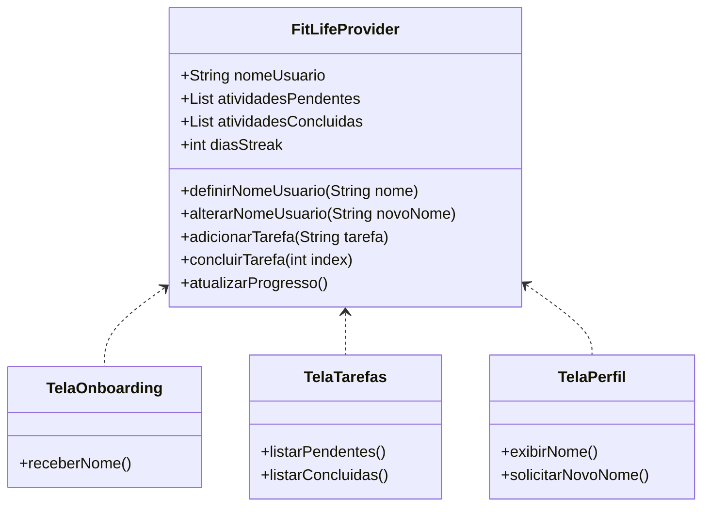

# Especificação de Requisitos do Software (ERS)
---

## 1. Introdução

### 1.1 Propósito

Este documento descreve os requisitos do aplicativo **FitLife**, um projeto Flutter voltado ao acompanhamento de tarefas voltadas à saúde, progresso de atividades e manutenção de metas (streaks).

O objetivo da documentação é:
- definir as funcionalidades principais do aplicativo identificadas no protótipo (wireframe);
- organizar os requisitos funcionais e não funcionais;
- orientar o desenvolvimento das telas de Onboarding, Gestão de Tarefas, Progresso e Perfil;
- servir como base para testes e validação da interface.

### 1.2 Escopo

O **FitLife** será um aplicativo mobile focado na criação de hábitos saudáveis por meio do registro e acompanhamento de atividades. 

O sistema permitirá:
- realizar um onboarding informando o nome de usuário inicial;
- adicionar novas tarefas/atividades de saúde;
- visualizar e separar atividades entre "Pendentes" e "Concluídas";
- consultar uma aba de Análise de Progresso;
- acompanhar a "Meta - Streak" (sequência de dias consecutivos de uso ou atividades);
- visualizar e alterar o nome de usuário na tela de perfil;
- navegar entre as telas utilizando uma barra de navegação inferior.

O aplicativo não possuirá autenticação por senha ou integração obrigatória com banco de dados em nuvem nesta versão inicial.

### 1.3 Definições, Acrônimos e Siglas

| Termo | Definição |
| ----- | --------- |
| Tarefa/Atividade | Ação a ser realizada pelo usuário em prol de sua saúde |
| Streak | Sequência de dias consecutivos em que o usuário atingiu suas metas |
| Onboarding | Tela inicial de boas-vindas apresentada na primeira execução do app |
| Dashboard | Tela de resumo com a análise de progresso e streaks |
| Provider | Biblioteca utilizada para gerenciamento de estado no Flutter |

### 1.4 Visão Geral do Documento

Este documento está organizado em: introdução, descrição geral do sistema, requisitos funcionais e não funcionais, regras de negócio, descrição das telas (baseado no wireframe), modelos do sistema, análise de risco e critérios de aceitação.

---

## 2. Descrição Geral do Sistema

### 2.1 Perspectiva do Sistema

O **FitLife** é uma aplicação mobile standalone desenvolvida em Flutter. O estado da aplicação (tarefas pendentes/concluídas, progresso, streak e nome do usuário) será controlado com **Provider**, refletindo as alterações imediatamente na interface.

---

### 2.2 Funções do Sistema

O sistema deve:
- receber o nome do usuário no primeiro acesso (Onboarding);
- cadastrar novas tarefas digitadas pelo usuário;
- transitar tarefas entre pendentes e concluídas;
- exibir estatísticas de progresso;
- manter e exibir a contagem de Streak (dias consecutivos);
- permitir a alteração do nome de usuário a qualquer momento.

### 2.3 Classes de Usuários

| Usuário | Descrição |
| ------- | --------- |
| Usuário do App | Indivíduo que busca melhorar sua saúde gerenciando tarefas diárias e acompanhando sua consistência. |

### 2.4 Ambiente Operacional
Compatível com Flutter (Android/iOS), focando inicialmente na proporção de telas de smartphones (ex: iPhone 16 conforme protótipo).

---

## 3. Requisitos do Sistema

### 3.1 Requisitos Funcionais

#### RF-001: Receber Nome de Usuário (Onboarding)
**Descrição:** Na primeira vez que o usuário abrir o app, deve ser exigida a inserção de um nome para prosseguir.
- **Prioridade:** Alta
**Critérios de Aceitação:**
- Exibir a logo "FitLife" e a frase "O melhor para sua saúde".
- Conter um campo de texto "Para começar, digite seu nome:".
- O botão "Começar" só deve liberar o acesso se o campo de nome estiver preenchido.

#### RF-002: Adicionar Nova Tarefa
**Descrição:** O sistema deve permitir a inserção rápida de novas atividades na tela principal de tarefas.
- **Prioridade:** Alta
**Critérios de Aceitação:**
- Exibir um campo de texto com o placeholder "Digite a nova Tarefa...".
- Conter um botão de ação (ícone) ao lado do campo para confirmar a inclusão.
- A tarefa recém-criada deve ir automaticamente para a lista de "Atividades Pendentes".

#### RF-003: Gerenciar Status das Atividades
**Descrição:** O usuário deve visualizar listas separadas de atividades e poder concluí-las.
- **Prioridade:** Alta
**Critérios de Aceitação:**
- Seção "Atividades Pendentes" com itens não finalizados.
- Seção "Atividades Concluídas" com itens finalizados.
- Ao marcar uma atividade pendente como feita, ela deve mover-se para as concluídas.

#### RF-004: Análise de Progresso
**Descrição:** Exibir métricas do usuário baseadas nas tarefas concluídas.
- **Prioridade:** Média
**Critérios de Aceitação:**
- A tela deve conter uma seção "Análise de Progresso" com cartões ou barras indicando o desempenho atual do usuário.

#### RF-005: Meta - Streak
**Descrição:** O aplicativo deve exibir a sequência de dias (streak) de uso ou metas atingidas.
- **Prioridade:** Alta
**Critérios de Aceitação:**
- Exibir uma seção "Meta - Streak".
- Apresentar visualmente os últimos dias (ex: 11, 12, 13, 14, 15) com indicadores (círculos) sinalizando o preenchimento da meta diária.

#### RF-006: Alterar Nome de Usuário
**Descrição:** O sistema deve permitir que o usuário altere o nome fornecido no onboarding.
- **Prioridade:** Alta
**Critérios de Aceitação:**
- Na tela de perfil, exibir o nome de usuário atual e a foto/avatar.
- Conter um botão/opção "Alterar nome de usuário".
- Ao alterar, a mudança deve refletir globalmente no aplicativo via Provider.

#### RF-007: Navegação
**Descrição:** Navegação entre telas via BottomNavigationBar.
- **Prioridade:** Alta
**Critérios de Aceitação:**
- Barra inferior visível nas telas de Tarefas, Progresso e Perfil (oculta no Onboarding).
- Conter ícones indicativos para as diferentes áreas do aplicativo.

---

### 3.2 Requisitos Não Funcionais

- **RNF-001 (Usabilidade):** Interface minimalista e limpa, utilizando tons claros e divisões em formato de "cards" arredondados, idêntico ao wireframe.
- **RNF-002 (Gerenciamento de Estado):** Utilizar `Provider` para propagar mudanças de nome de usuário e de estado das tarefas instantaneamente entre as abas.
- **RNF-003 (Armazenamento Local):** As tarefas, streak e nome do usuário devem ser persistidos localmente (ex: `shared_preferences` ou `Hive`) para não serem perdidos ao fechar o app.

---

## 4. Regras de Negócio

| Regra de Negócio | Descrição |
| ---------------- | --------- |
| RN-001 | O nome de usuário não pode estar em branco durante o fluxo de Onboarding. |
| RN-002 | Uma tarefa só pode ser adicionada se o campo "Digite a nova Tarefa..." não for vazio. |
| RN-003 | O avanço do "Streak" é computado a cada dia que o usuário conclui pelo menos uma (ou todas, dependendo da configuração) atividade proposta. |
| RN-004 | A alteração de nome de usuário deve refletir em tempo real no cabeçalho das outras abas (se aplicável) e na própria tela de perfil. |

---

## 5. Telas do Aplicativo (Baseado nos Wireframes)

### 5.1 Tela 1: Onboarding (iPhone 16 - 1)
- **Elementos:** Logo FitLife, subtítulo de saúde, instrução para digitação do nome, campo de texto "Nome...", botão "Começar".
- **Ação:** Salva o nome de usuário no Provider e redireciona para a Tela Principal.

### 5.2 Tela 2: Principal / Tarefas (iPhone 16 - 2)
- **Elementos:** Header com foto de perfil e nome "FitLife". Campo para digitar nova tarefa com botão de `+`.
- **Listas:** "Atividades Pendentes" (cards em cinza claro) e "Atividades Concluidas" (cards em cinza claro).
- **Rodapé:** Bottom Navigation Bar.

### 5.3 Tela 3: Dashboard / Progresso (iPhone 16 - 3)
- **Elementos:** Header padrão.
- **Seção 1:** "Análise de Progresso" contendo uma lista de campos de métricas.
- **Seção 2:** "Meta - Streak" contendo 5 indicadores visuais de sequência diária (bolinhas representando dias passados e atuais).
- **Rodapé:** Bottom Navigation Bar.

### 5.4 Tela 4: Perfil / Configurações (iPhone 16 - 4)
- **Elementos:** Header padrão.
- **Card Principal:** Exibe o "Nome de Usuário" gravado no Onboarding ao lado de um grande avatar circular.
- **Opções:** Botão com ícone para "Alterar nome de usuário".
- **Rodapé:** Bottom Navigation Bar.

---

## 6. Modelos do Sistema

### 6.1 Diagrama de Casos de Uso

### 6.2 Diagrama de Classes (Gerenciamento de Estado)

---

## 7. Critérios Gerais de Aceitação

- [ ] O aplicativo exibe a tela de onboarding apenas se o usuário ainda não tiver um nome cadastrado.
- [ ] O input do onboarding "Para começar, digite seu nome:" salva o dado corretamente.
- [ ] É possível inserir tarefas na tela inicial que vão diretamente para "Atividades Pendentes".
- [ ] A tela de "Meta - Streak" exibe os dias corretamente alinhados.
- [ ] O campo "Alterar nome de usuário" na aba de Perfil consegue sobrescrever o nome salvo no Onboarding e atualiza a interface via Provider.